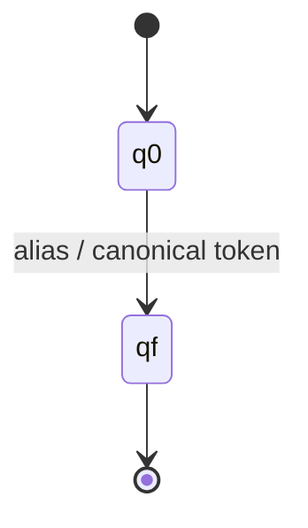

# Stage 2 — Finite-State Transducer Formalization

ResumeLens models qualification normalization as a family of deterministic lexical transductions.

## General 7-tuple

For each alias mapping transducer:

**M = (Q, Σ, Γ, δ, ω, q0, F)**

- **Q** = `{q0, qf}`
- **Σ** = finite input alphabet containing the alias strings used by the project
- **Γ** = finite output alphabet containing canonical qualification symbols
- **δ** = transition relation containing `(q0, alias, qf)` for every supported alias
- **ω** = output relation mapping each alias to its canonical token
- **q0** = initial state
- **F** = `{qf}`

Examples:

- `JS → JAVASCRIPT`
- `Javascript → JAVASCRIPT`
- `React.js → REACT`
- `ReactJS → REACT`
- `NodeJS → NODE_JS`
- `Postgres → POSTGRESQL`
- `sklearn → SCIKIT_LEARN`
- `scikit-learn → SCIKIT_LEARN`
- `Tensor Flow → TENSORFLOW`
- `PyTorch → PYTORCH`

These are project-defined transformations rather than the only possible aliases.

## Graphical representation

The implementation constructs a `pyformlang.finite_transducer.Transducer` when the dependency is installed. The explicit mapping table is retained as the deterministic application layer so multi-token and punctuation-bearing aliases remain easy to inspect.
